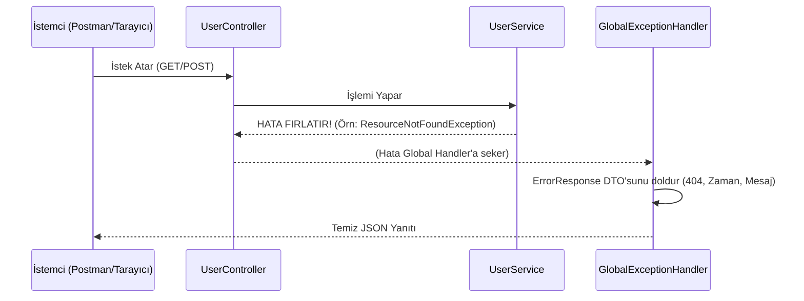

# 🛡️ Spring Boot Global Exception Handling API

A best-practice boilerplate project demonstrating how to handle errors centrally and professionally in Spring Boot applications using `@RestControllerAdvice`.

## 📖 Proje Hakkında (About the Project)

Bu proje, Spring Boot uygulamalarında hataları (Exceptions) merkezi bir yerden yönetmek için tasarlanmış bir altyapı (boilerplate) projesidir. 

**Neden Gerekli?** 
Normalde Spring Boot, hata durumlarında karmaşık ve Frontend geliştiricileri için anlaşılması zor olan sayfalar döndürür (Whitelabel Error Page veya uzun Stack Trace logları). Bu proje; uygulamanın neresinde hata çıkarsa çıksın, hataları havada yakalar ve Frontend'e (React, Angular, Mobil vb.) her zaman **standart, temiz ve anlaşılır bir JSON** formatında iletir.

## 🚀 Özellikler (Features)

- **Merkezi Kalkan (`@RestControllerAdvice`):** Tüm `try-catch` bloklarını çöpe atın! Tüm hatalar tek bir merkezden yönetilir.
- **Standart Yanıt Formatı (DTO):** Her hata durumunda aynı JSON kalıbı (`timestamp`, `status`, `message`, `path`) dönülür.
- **Validasyon Yönetimi (Data Validation):** Kullanıcının eksik veya hatalı form verileri girdiğinde (`@NotBlank`, `@Email`), bu hataları listeleyip tek bir JSON içinde şıkça gösterir (HTTP 400 - Bad Request).
- **Özel Hatalar (Custom Exceptions):** Veritabanında veri bulunamadığında fırlatılan özel kurgulanmış `ResourceNotFoundException` (HTTP 404 - Not Found).
- **Çerçeve Hataları:** Beklenmeyen HTTP metotları (POST yerine GET atılması - HTTP 405) gibi yapısal hataların yakalanması.

## 🏗️ Mimari Şema



## 🧪 Nasıl Test Edilir? (Postman)

Projeyi ayağa kaldırdıktan sonra aşağıdaki senaryoları test edebilirsiniz:

### 1. Başarılı İstek (HTTP 200)
- **Metot:** `GET`
- **URL:** `http://localhost:8080/api/users/5`
- **Beklenen Sonuç:** İşlem başarılı mesajı.

### 2. Bulunamadı Hatası (HTTP 404)
- **Metot:** `GET`
- **URL:** `http://localhost:8080/api/users/99`
- **Beklenen Sonuç (JSON):**
```json
{
    "timestamp": "2026-08-01T12:45:00.123",
    "status": 404,
    "message": "User not found in DB! Requested ID: 99",
    "path": "/api/users/99"
}
```

### 3. Validasyon Hatası (HTTP 400)
- **Metot:** `POST`
- **URL:** `http://localhost:8080/api/users`
- **Body (JSON):**
```json
{
    "name": "",
    "email": "hatali-mail-adresi",
    "password": "123"
}
```
- **Beklenen Sonuç (JSON):** Her bir hatalı alan için detaylı validasyon listesi.

### 4. Yanlış HTTP Metodu Hatası (HTTP 405)
- **Metot:** `GET` *(Normalde POST atılması gereken yere)*
- **URL:** `http://localhost:8080/api/users`
- **Beklenen Sonuç (JSON):** Desteklenmeyen HTTP metoduna dair JSON yanıtı.

## 🛠️ Teknolojiler
- Java 
- Spring Boot (Web, Validation)
- Lombok
- Maven
