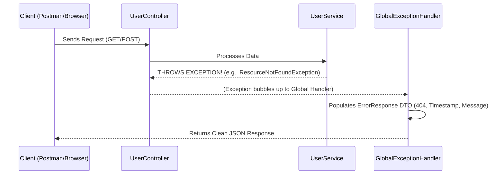

#  Spring Boot Global Exception Handling API

A best-practice boilerplate project demonstrating how to handle errors centrally and professionally in Spring Boot applications using `@RestControllerAdvice`.

##  About the Project

This project is a boilerplate architecture designed to manage exceptions from a centralized location in Spring Boot applications.

**Why is it necessary?**
Normally, when an error occurs, Spring Boot returns complex pages that are difficult for Frontend developers to understand (such as the Whitelabel Error Page or long Stack Trace logs). This project intercepts errors on the fly, no matter where they occur in the application, and always delivers a **standard, clean, and predictable JSON** format to the Frontend (React, Angular, Mobile, etc.).

##  Features

- **Centralized Shield (`@RestControllerAdvice`):** Throw away all those `try-catch` blocks! All errors are managed from a single center.
- **Standard Response Format (DTO):** The same JSON structure (`timestamp`, `status`, `message`, `path`) is returned for every error case.
- **Data Validation Management:** When a user enters missing or invalid form data (`@NotBlank`, `@Email`), it catches these errors, lists them, and presents them elegantly in a single JSON (HTTP 400 - Bad Request).
- **Custom Exceptions:** A custom `ResourceNotFoundException` is thrown and handled when data is not found in the database (HTTP 404 - Not Found).
- **Framework Errors:** Intercepts structural errors such as unexpected HTTP methods (e.g., sending a GET request when a POST is expected - HTTP 405).
- **Catch-All Safety Net:** A final fallback handler (`Exception.class`) that catches any unforeseen or unexpected server errors (like `NullPointerException` or database disconnects), guaranteeing the API never returns a raw stack trace, but rather a clean HTTP 500 JSON response.

##  Architecture Diagram



### Flowchart (Exception Routing)

```mermaid
flowchart TD
    Req([Incoming Request]) --> Layer{Controller / Service}
    Layer -- "Success" --> Res([Return HTTP 200])
    Layer -- "Throws Exception" --> Shield((@RestControllerAdvice))
    
    Shield --> Type{Exception Type?}
    Type -- "ResourceNotFoundException" --> Ex404[Status 404]
    Type -- "MethodArgumentNotValidException" --> Ex400[Status 400 + Validation Map]
    Type -- "HttpRequestMethodNotSupported" --> Ex405[Status 405]
    Type -- "Any other Exception" --> Ex500[Status 500 Catch-All]
    
    Ex404 --> DTO[Format as ErrorResponse DTO]
    Ex400 --> DTO
    Ex405 --> DTO
    Ex500 --> DTO
    
    DTO --> Final([Return Clean JSON to Client])
    
    style Shield fill:#e1bee7,stroke:#8e24aa,stroke-width:2px,color:#000
    style DTO fill:#c8e6c9,stroke:#388e3c,stroke-width:2px,color:#000
    style Final fill:#bbdefb,stroke:#1976d2,stroke-width:2px,color:#000
```

## 🤝 How to Use This in Your Own Projects?

This project is a boilerplate designed to be integrated into actual Spring Boot applications. You can use it in your company or personal projects in the following ways:

### 1. Copy-Paste (The Boilerplate Approach)
If you are building a small/medium Spring Boot project, simply copy these three files into your project:
*   `ErrorResponse.java`
*   `ResourceNotFoundException.java`
*   `GlobalExceptionHandler.java`

Thanks to the `@RestControllerAdvice` annotation, Spring Boot will automatically detect it, and your new project will instantly have professional exception handling!

### 2. GitHub Template
You can set this repository as a **Template Repository** on GitHub. When starting a new microservice or API, click **"Use this template"**. You will get a brand new repository with this exception handling architecture already built-in, saving you from writing boilerplate code.


## How to Test? (Postman)

After starting the project, you can test the following scenarios:

### 1. Successful Request (HTTP 200)
- **Method:** `GET`
- **URL:** `http://localhost:8080/api/users/5`
- **Expected Result:** Success message string.

### 2. Not Found Error (HTTP 404)
- **Method:** `GET`
- **URL:** `http://localhost:8080/api/users/99`
- **Expected Result (JSON):**
```json
{
    "timestamp": "2026-08-01T12:45:00.123",
    "status": 404,
    "message": "User not found in DB! Requested ID: 99",
    "path": "/api/users/99"
}
```

### 3. Validation Error (HTTP 400)
- **Method:** `POST`
- **URL:** `http://localhost:8080/api/users`
- **Body (JSON):**
```json
{
    "name": "",
    "email": "invalid-email-address",
    "password": "123"
}
```
- **Expected Result (JSON):** A detailed list of validation errors for each invalid field.

### 4. Method Not Allowed Error (HTTP 405)
- **Method:** `GET` *(To an endpoint that only expects POST)*
- **URL:** `http://localhost:8080/api/users`
- **Expected Result (JSON):** JSON response indicating the unsupported HTTP method.

##  Technologies
- Java 
- Spring Boot (Web, Validation)
- Lombok
- Maven
